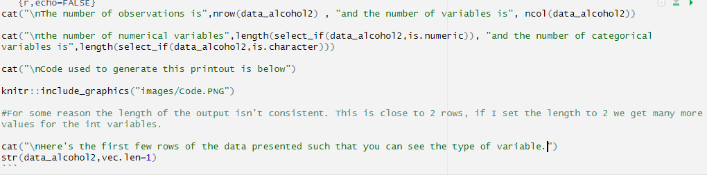

```{r,include=FALSE}
#Loading libraries
library("dplyr")
library(tidyverse)
library(grid)
library("knitr")
library("usethis")
library(ggplot2)
```
## Research question

In this report I aim to investigate how the distribution of types of alcohol consumed over time across different countries has changed. In particular I wish to explore how the trends have overall changed and which countries differ from this trend.
  
```{r}
#Load the data
data_alcohol <- read.csv("Data/alcohol-by-type-1890.csv")
#Remove 'CODE' as this is an extraneous variable
data_alcohol = subset(data_alcohol, select = -c(2))
data_alcohol2 = data_alcohol
#Rename some variables for ease of reading
names(data_alcohol2) <- c("Country", "Year", "SpiritsPercentage","BeerPercentage","WinePercentage")

```

## Data Introduction

This dataset tracks the proportion of different types of alcohol over time across a range of countries. The data itself is derived from annual databases on wine, compiled by the university of Adelaide.

The variables tracking beer, wine and spirits % represents how much each type of beverage made of total alcohol consumption. The total consumption is based off these 3 drinks so does not include other types such as cider. Year and State variables simply track where and when each observation was made. 

[Data can be found here](https://ourworldindata.org/grapher/alcohol-by-type-1890?tab=table&country=~FRA)

Below is a table displaying the data for just Australia, with the renamed variables in use. A separate table providing the original variable names is also provided to provide clarity.
```{r}
#Make a table of the first 5 entries only
table_alcohol <- head(data_alcohol2,5)
#Display table
knitr::kable(table_alcohol, 
             caption = "Alcohol consumption by type, Australia",
             digits = 2)
#Repeat but for dataframe with old variables
table_alcohol <- head(data_alcohol,5)
knitr::kable(table_alcohol, 
             caption = "Alcohol consumption by type, Australia",
             digits = 2)
```

## Data Set Description

```{r}
cat("\nThe number of observations is",nrow(data_alcohol2) , "and the number of variables is", ncol(data_alcohol2))

cat("\nthe number of numerical variables",length(select_if(data_alcohol2,is.numeric)), "and the number of categorical variables is",length(select_if(data_alcohol2,is.character)))

cat("\nCode used to generate this printout is below")



#For some reason the length of the output isn't consistent. This is close to 2 rows, if I set the length to 2 we get many more values for the int variables.

#USE UNGROUP() TO FIX THE ISSUE, THEN REDO SCREENSHOT

cat("\nHere's the first few rows of the data presented such that you can see the type of variable.")
str(data_alcohol2,vec.len=1)
```


## Data set summary

```{r}
group_by(data_alcohol2)

#Group data frame by year
data_alcohol_grouped = data_alcohol2 %>% group_by(Year) 

#Summarise Beer and Wine by their means across each year. This creates a 'mean of beer drunk per year'.
data_alcohol_grouped2 = data_alcohol_grouped %>% summarise_at(.vars = vars(BeerPercentage,WinePercentage),
               .funs = c(mean="mean"))
#Same process but for variance.
data_alcohol_grouped = data_alcohol_grouped %>% summarise_at(.vars = vars(BeerPercentage,WinePercentage),
               .funs = c(var="var"))
#Save results from above as vectors in dataframe
data_alcohol_grouped$BeerPercentage_mean=data_alcohol_grouped2$BeerPercentage_mean
data_alcohol_grouped$WinePercentage_mean=data_alcohol_grouped2$WinePercentage_mean
#Display data
kable(data_alcohol_grouped, caption = "Mean and variance of beer and wine across all countries over time.")
```

This data summary suggests that across all countries, the proportion of beer drunk rose over time and peaked in 1964, while wine rose, dipped in 1964, then continued to rise to its current record proportion. Both wine and beer saw a **sharp** decline in variance over time, indicating many countries converging towards a similar proportion of beer and wine drunk.
   
```{r, fig.width=10,fig.height=11}

#Convert data to long format so it's more easily graphed
data_alcohol_graph <- data_alcohol2 %>% pivot_longer(cols = c(BeerPercentage, WinePercentage,  SpiritsPercentage),
                           names_to = "Drink_Type")

#Generate GGplot. Very straightforward plot, the y-axis is the value of Beer/Wine/Spirits percentage which we summarised into one column when we made data long above. Colour by drink type, facet by country then label the information.
ggplot(data = data_alcohol_graph, aes(x = factor(Year))) +
  geom_point(aes(y=value,col=Drink_Type)) + 
  facet_wrap(~Country) + 
  labs(caption = "This simple graph allows an easy visualisation of trends over time. One graph is provided for each country. ",color="Type Of Drink\n") +
  scale_color_manual(labels = c("Beer", "Wine","Spirits"),values = c("blue", "red","black")) +
  xlab('Year') +
  ylab("Proportion Drunk")
```

### Observations

* *Wine saw an increase in many countries, Beer generally rose then dipped then rose again, spirits generally dipped.*
* *Outlier data is the fall of wine in france and switzerland, the increase of beer in finland, and the increase of spirits in the UK.*

## Conclusions

This provides a cursory overview of the data. The summary and the graph help describe the general trends across many countries. The graph also allows us to identify the listed outliers. These graphs also show the large variance in beer and wine in earlier years that was noted earlier, as well as a similar pattern for spirits. Unfortunately, many countries lack data points for some years, such as Norway and Finland. This makes proper analysis of the trend difficult.

Overall I have identified patterns in the overall trends, with wine increasing, beer rising, falling, then rising again and spirits dipping. I also have identified outlier countries which could form a basis for further analysis.


## Expansion

As noted earlier, there were some outlier values, and indication these values were more common in the past. Next I elaborate by investigating these differences.

Below is a table of the highest positive differences, where countries drink more of a particular type than the global mean. The differences are generally stronger in this direction in this dataset and so are most interesting. A near identical procedure can create a similar analysis of the differences in the other direction.

```{r}
group_by(data_alcohol2)
#Same as the earlier iteration, group by year.
data_alcohol_grouped = data_alcohol2 %>% group_by(Year) 
#Summarise mean by each year.
data_alcohol_grouped3 = data_alcohol_grouped %>% summarise_at(.vars = vars(BeerPercentage,WinePercentage,SpiritsPercentage),
               .funs = c(mean="mean"))

#Join the two dataframes by year. One dataframe contains the original data which includes how much of each type of drink is consumed by each country each year, and the other contains the 'global mean' for each variable per year. Creates a version of the original table where the global mean per year can be compared to the entries with a matching year easily.
data_alcohol_grouped=left_join(data_alcohol_grouped, data_alcohol_grouped3, by = 'Year')

#Create a difference between an entry's beer/wine/spirits drunk and the global mean, done by year. Save the difference into each entry/row.
data_alcohol_grouped$diffWine <- data_alcohol_grouped$WinePercentage - data_alcohol_grouped$WinePercentage_mean
data_alcohol_grouped$diffBeer <- data_alcohol_grouped$BeerPercentage - data_alcohol_grouped$WinePercentage_mean
data_alcohol_grouped$diffSpirits <- data_alcohol_grouped$SpiritsPercentage - data_alcohol_grouped$WinePercentage_mean

#Now we want to decipher where the divergences from the mean are largest.
#Arrange so biggest differences at the top.
arrange(data_alcohol_grouped, by_group = diffWine)
#Data needs to be ungrouped, seems to be grouped by country so top 5 selects top 5 countries rather than top 5 entries.
ungroup_df = ungroup(data_alcohol_grouped)
#Then pick out top 5 entries of the diffWine vector after it was sorted top to bottom.
#Repeat for beer and spirits.
Wine_Deviants <- top_n(ungroup_df,5,diffWine)
arrange(data_alcohol_grouped, by_group = diffBeer)
Beer_Deviants <- top_n(ungroup_df,5,diffBeer)
arrange(data_alcohol_grouped, by_group = diffSpirits)
Spirits_Deviants <- top_n(ungroup_df,5,diffSpirits)

#Remove extraneous columns
Wine_Deviants <- Wine_Deviants[ -c(3:8,10,11) ]
Beer_Deviants <- Beer_Deviants[ -c(3:9,11) ]
Spirits_Deviants <- Spirits_Deviants[ -c(3:10) ]

#Make country vector names more comprehensible for final analsysis
names(Wine_Deviants) <- c("CountryWine", "Year", "DiffWine")
names(Beer_Deviants) <- c("CountryBeer", "Year", "DiffBeer")
names(Spirits_Deviants) <- c("CountrySpirits", "Year", "DiffSpirits")


#Select the rows from our initial data table that we found had the highest variance
#This solution is a bit poor as it only works with my knowledge of what the values for the highest variance entries already are. A more wise approach would automate this by pulling the values from the 'Spirits/Wine/Beer_Deviants" tables directly. This still works fine for my purposes however.

WineDiff1 <- data_alcohol_grouped[data_alcohol_grouped$Country == 'France' & data_alcohol_grouped$Year == 1964, ]
WineDiff2 <- data_alcohol_grouped[data_alcohol_grouped$Country == 'Italy' & data_alcohol_grouped$Year == 1890, ]
WineDiff3 <- data_alcohol_grouped[data_alcohol_grouped$Country == 'Italy' & data_alcohol_grouped$Year == 1929, ]
WineDiff4 <- data_alcohol_grouped[data_alcohol_grouped$Country == 'Italy' & data_alcohol_grouped$Year == 1964, ]
WineDiff5 <- data_alcohol_grouped[data_alcohol_grouped$Country == 'Italy' & data_alcohol_grouped$Year == 1984, ]

#We remove extraneous values. For example we eventually want a list of the 5 entries with the higest deviation from the mean in wine consumption, so we remove values relating to beer and spirits for clarity.

WineDiff1[c(3,4,6,8,10,11)] = NA
WineDiff2[c(3,4,6,8,10,11)] = NA
WineDiff3[c(3,4,6,8,10,11)] = NA
WineDiff4[c(3,4,6,8,10,11)] = NA
WineDiff5[c(3,4,6,8,10,11)] = NA

BeerDiff1 <- data_alcohol_grouped[data_alcohol_grouped$Country == 'Australia' & data_alcohol_grouped$Year == 1964, ]
BeerDiff2 <- data_alcohol_grouped[data_alcohol_grouped$Country == 'Belgium' & data_alcohol_grouped$Year == 1964, ]
BeerDiff3 <- data_alcohol_grouped[data_alcohol_grouped$Country == 'Denmark' & data_alcohol_grouped$Year == 1964, ]
BeerDiff4 <- data_alcohol_grouped[data_alcohol_grouped$Country == 'Denmark' & data_alcohol_grouped$Year == 1964, ]
BeerDiff5 <- data_alcohol_grouped[data_alcohol_grouped$Country == 'United Kingdom' & data_alcohol_grouped$Year == 1964, ]

BeerDiff1[c(3,5,7,8,9,11)] = NA
BeerDiff2[c(3,5,7,8,9,11)] = NA
BeerDiff3[c(3,5,7,8,9,11)] = NA
BeerDiff4[c(3,5,7,8,9,11)] = NA
BeerDiff5[c(3,5,7,8,9,11)] = NA

SpiritsDiff1 <- data_alcohol_grouped[data_alcohol_grouped$Country == 'Finland' & data_alcohol_grouped$Year == 1964, ]
SpiritsDiff2 <- data_alcohol_grouped[data_alcohol_grouped$Country == 'Japan' & data_alcohol_grouped$Year == 1964, ]
SpiritsDiff3 <- data_alcohol_grouped[data_alcohol_grouped$Country == 'Japan' & data_alcohol_grouped$Year == 1984, ]
SpiritsDiff4 <- data_alcohol_grouped[data_alcohol_grouped$Country == 'Netherlands' & data_alcohol_grouped$Year == 1890, ]
SpiritsDiff5 <- data_alcohol_grouped[data_alcohol_grouped$Country == 'Norway' & data_alcohol_grouped$Year == 1964, ]

SpiritsDiff1[c(4:7,9,10)] = NA
SpiritsDiff2[c(4:7,9,10)] = NA
SpiritsDiff3[c(4:7,9,10)] = NA
SpiritsDiff4[c(4:7,9,10)] = NA
SpiritsDiff5[c(4:7,9,10)] = NA

#Bind final dataframe together, each entry I just constructed becomes a separate row, each row contains the original dataframes entry, with the drink difference variable attached, and the variables relating to other drinks removed.

FinalDataframe <- bind_rows(WineDiff1,WineDiff2,WineDiff3,WineDiff4,WineDiff5,BeerDiff1,BeerDiff2,BeerDiff3,BeerDiff4,BeerDiff5,SpiritsDiff1,SpiritsDiff2,SpiritsDiff3,SpiritsDiff4,SpiritsDiff5)
```
This table displays the entries with greatest deviance from the global mean per year. Each entry only corresponds to one type of drink, so columns for the other types of drinks are left blank for each entry.
```{r}
#Display the new table
kable(FinalDataframe)
```
This graph provides a more thorough overview of the situation than the aforementioned table. All entries are included, the graph is faceted according to country and color coded according to drink type. Additionally, a bar line is provided in the graph, this line indicates where the deviation from the mean is zero. It allows an easy way to see how the amount of variance changes over time.
```{r,fig.width=10,fig.height=11,}
FinalDataframe2 = subset(data_alcohol_grouped, select = -c(3:8))
#Same as last graph actually, convert data to long for easy access.
FinalDataframe3Graphing <- FinalDataframe2 %>% pivot_longer(cols = c(diffWine, diffBeer,  diffSpirits),
                           names_to = "Difference_Type")
#Don't plot NA values
FinalDataframe3Graphing <- na.omit(FinalDataframe3Graphing)

#Graph is same as before now.
ggplot(data = FinalDataframe3Graphing, aes(x = factor(Year))) +
  geom_point(aes(y=value,col=Difference_Type)) + 
  labs(color="Type Of Drink\n") +
  facet_wrap(~Country) +
  xlab('Year') +
  ylab("Deviation from global mean") +
  scale_color_manual(labels = c("Beer", "Spirits","Wine"),values = c("blue", "red","black")) +
  ylim(-35, 70) +
  geom_hline(yintercept=0) 
```

### Conclusions 

This further analysis serves to provide detail to existing conclusions. We can see Italy consistently drunk more wine than other countries. Denmark and Japan seemed to be the greatest excess consumers of beer and spirits, respectively. Additionally, all 15 entries tabulated occurred before 2014, and most entries appear in the year of 1964. This seems to confirm the findings of the graph.

The chart shows a consistent trend towards the global mean for all countries over time. For each country, the drink with the largest difference from global mean is either beer or spirits, with only 3 out of 16 countries drinking more wine than others. Spirits and beer have similar numbers, though beer leads slightly more often. The 3 top wine consumers are geographically close, which provides weak support for the hypothesis that globalisation is the cause of a general move towards all countries having more similar drink distribution.